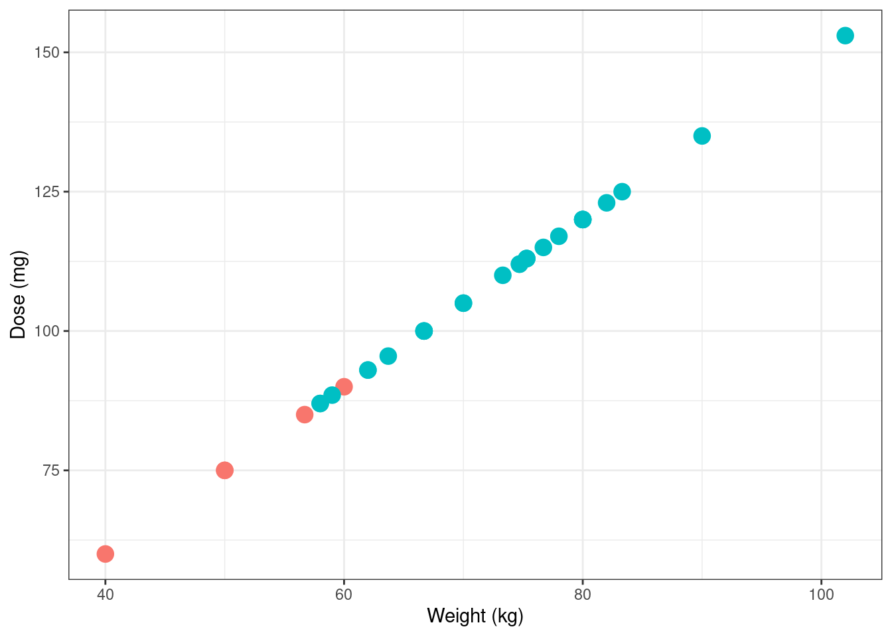
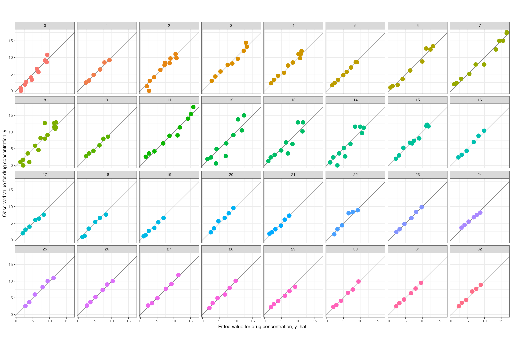
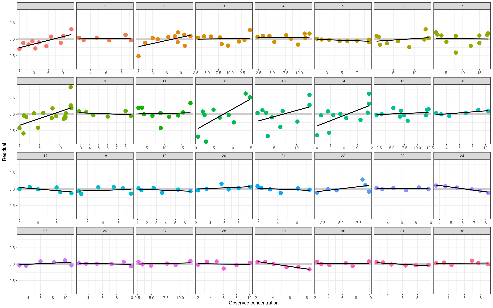

<!--------------- my typical setup ----------------->


<!--------------- post begins here ----------------->


**Note**: This is the third post in a series on pharmacometric modelling, and implicitly assumes some knowledge of the concepts outlined in the first two: 

- The first post talked about [non-compartmental analysis](/non-compartmental-analysis/) and in the process introduced some basic terminology used in pharamacometrics
- The second post talked about building [compartmental models in Stan](/stan-ode/) and introduced a lot of the ideas I'll build on here

In the earlier posts I didn't touch any real data sets, and only considered an idealised case where you have data from only a single person and therefore have no need for population models. I'll address both of those shortcomings in this post.

## Prologue

All the way back in 2006 I published a paper in the *Journal of Mathematical Psychology* called "Modelling individual differences with Dirichlet processes" with a bunch of no-name coauthors.^[Yes this is indeed a joke. Tom Griffiths, Mark Steyvers, and Michael Lee are all considerably more successful as academics than I ever was, so much so that when Mark fed the text of the paper -- which is about 99% my writing -- into an author-topic model that allows specific passages to be attributed to specific authors, it did not attribute a single word of the text to me. Oh well.] In brutal honesty the paper should probably have been called "Everything Danielle knows about Dirichlet processes, with a fig leaf of pretense of applying it to data", but it did allow me to use the following utterly unhinged quote from an anonymous reviewer on an earlier paper:

> I am surprised that the author has used this data set. In my lab, when we collect data with such large individual differences, we refer to the data as "junk". We then re-design our stimuli and/or experimental procedures, and run a new experiment. The junk data never appear in publications

This attitude, which I have encountered from time to time in research, utterly puzzles me. One of the most salient things about human thought and behaviour is that... well, people think and act differently to each other. If you want to understand the human mind, you kinda have to engage with that fact and develop experiments and modelling techniques that can accommodate this variation. I expressed the idea schematically in Figure 2 of the paper:

{fig-align=center}

I am still quite fond of this figure. It nicely captures the idea that when developing population models we are usually operating in three spaces at once:

- At the **data level** we have observable quantities that we can measure in our experiments. Each person in our study can have different data values, and people can differ from each other in all kinds of ways
- At the **individual level** we seek to infer the parameters of a model that can summarise the observations from a single person in a theoretically meaningful way, and account for how those observations might vary as a function of covariates. 
- At the **population level** we seek to infer parameters that describe the typical parameter values associated with individuals, and how those parameter values typically vary across individuals.

Shockingly, it turns out that this basic framework is not even slightly specific to psychology. It's something that shows up in almost every scientific domain, and there are standard statistical tools that we use to capture this idea that are surprisingly similar to one another even when the domain of application differs. 

And so it transpires that, as I continue the process of teaching myself pharmacometrics, I discover that the modelling tools used in **population pharmacokinetics** (pop-PK) are shockingly familiar to me. So let's dive in, shall we?

## Some resources

To make the transition from modelling toy data sets to dealing with real ones, it helps a lot to have some real data to work with, and a worked example that shows how real data are analysed in practice. To that end, I've been relying on resources made publicly abailable by the [Population Approach Group of Australia and New Zealand](https://www.paganz.org/), who have a series of [handy tutorials](https://www.paganz.org/resources/) for folks interested in pharmacometric modelling. The one I'm working through at the moment is a [2019 workshop on pop-PK models](https://www.paganz.org/wp-content/uploads/2016/06/PAWs-Beginners-2019.zip) (link goes to a zip file), which provides a very nice tutorial on building such models.

The only catch, from my perspective, is that the tutorial uses the  [NONMEM](https://www.iconplc.com/solutions/technologies/nonmem/) pharmacometrics software, and I don't have access to NONMEM. So as a fun little exercise, I'm going to translate some of the code from the workshop from NONMEM to Stan (and R).

## The warfarin data set

The data set used in the tutorial is based on some old studies in the 1960s on the pharmacokinetics of [warfarin](https://en.wikipedia.org/wiki/Warfarin), an anticoagulant medication that is probably well-known to most people (I mean, even I know what warfarin is). The data is provided as a csv file called "warfpk.csv", so my first step will be to import the data into R so that I can work with it. 

### Parsing the data

Reading the data into R using `readr::read_csv()` turns out to be mostly straightforward. Data are delimited with commas and there's very little weirdness to deal with. The only thing that is non-standard for an R user is that the data file uses `"."` to specify missing values (which I'm guessing is standard in pharmacometrics), so I'll need to state that explicitly when reading the data into R to ensure that numeric variables with missing values are correctly parsed as numeric:


::: {.cell}

```{.r .cell-code}
warfpk <- readr::read_csv("warfpk.csv", na = ".", show_col_types = FALSE)
warfpk
```

::: {.cell-output .cell-output-stdout}
```
# A tibble: 289 × 10
   `#ID`  time    wt   age   sex   amt  rate  dvid    dv   mdv
   <chr> <dbl> <dbl> <dbl> <dbl> <dbl> <dbl> <dbl> <dbl> <dbl>
 1 0       0    66.7    50     1   100    -2     0  NA       1
 2 0       0.5  66.7    50     1    NA    NA     1   0       0
 3 0       1    66.7    50     1    NA    NA     1   1.9     0
 4 0       2    66.7    50     1    NA    NA     1   3.3     0
 5 0       3    66.7    50     1    NA    NA     1   6.6     0
 6 0       6    66.7    50     1    NA    NA     1   9.1     0
 7 0       9    66.7    50     1    NA    NA     1  10.8     0
 8 0      12    66.7    50     1    NA    NA     1   8.6     0
 9 0      24    66.7    50     1    NA    NA     1   5.6     0
10 0      36    66.7    50     1    NA    NA     1   4       0
# ℹ 279 more rows
```
:::
:::


These column names are pretty standard in the field, in part because standard software like NONMEM expects these names. They're perfectly fine for R too, with one minor exception: I'm going to rename the id variable using `dplyr::rename()`:


::: {.cell}

```{.r .cell-code}
warfpk <- warfpk |> dplyr::rename(id = `#ID`)
warfpk
```

::: {.cell-output .cell-output-stdout}
```
# A tibble: 289 × 10
   id     time    wt   age   sex   amt  rate  dvid    dv   mdv
   <chr> <dbl> <dbl> <dbl> <dbl> <dbl> <dbl> <dbl> <dbl> <dbl>
 1 0       0    66.7    50     1   100    -2     0  NA       1
 2 0       0.5  66.7    50     1    NA    NA     1   0       0
 3 0       1    66.7    50     1    NA    NA     1   1.9     0
 4 0       2    66.7    50     1    NA    NA     1   3.3     0
 5 0       3    66.7    50     1    NA    NA     1   6.6     0
 6 0       6    66.7    50     1    NA    NA     1   9.1     0
 7 0       9    66.7    50     1    NA    NA     1  10.8     0
 8 0      12    66.7    50     1    NA    NA     1   8.6     0
 9 0      24    66.7    50     1    NA    NA     1   5.6     0
10 0      36    66.7    50     1    NA    NA     1   4       0
# ℹ 279 more rows
```
:::
:::


Looking at this output more carefully, there's one slightly puzzling thing here: the `id` column looks like it's supposed to be a numeric id for the study participants, but R has parsed as a character vector. So there must be one non-numeric value in this column. I'd better find out what's going on there. A bit of digging reveals there's something peculiar going on with subject 12. Using `dplyr::filter()` to extract the data for that person we get this:


::: {.cell}

```{.r .cell-code}
warfpk |> dplyr::filter(id |> stringr::str_detect("12"))
```

::: {.cell-output .cell-output-stdout}
```
# A tibble: 11 × 10
   id     time    wt   age   sex   amt  rate  dvid    dv   mdv
   <chr> <dbl> <dbl> <dbl> <dbl> <dbl> <dbl> <dbl> <dbl> <dbl>
 1 12      0    75.3    32     1   113    -2     0  NA       1
 2 12      1.5  75.3    32     1    NA    NA     1   0.6     0
 3 #12     3    75.3    32     1    NA    NA     1   2.8     0
 4 12      6    75.3    32     1    NA    NA     1  13.8     0
 5 12      9    75.3    32     1    NA    NA     1  15       0
 6 12     24    75.3    32     1    NA    NA     1  10.5     0
 7 12     36    75.3    32     1    NA    NA     1   9.1     0
 8 12     48    75.3    32     1    NA    NA     1   6.6     0
 9 12     72    75.3    32     1    NA    NA     1   4.9     0
10 12     96    75.3    32     1    NA    NA     1   2.4     0
11 12    120    75.3    32     1    NA    NA     1   1.9     0
```
:::
:::


My first thought upon seeing this was that it must be a typo in the data file. No problem, it's easy enough to remove the `#` character and convert the id variable to numeric:


::: {.cell}

```{.r .cell-code}
warfpk <- warfpk |> 
  dplyr::mutate(
    id = id |> 
      stringr::str_remove_all("#") |> 
      as.numeric()
  )
warfpk
```

::: {.cell-output .cell-output-stdout}
```
# A tibble: 289 × 10
      id  time    wt   age   sex   amt  rate  dvid    dv   mdv
   <dbl> <dbl> <dbl> <dbl> <dbl> <dbl> <dbl> <dbl> <dbl> <dbl>
 1     0   0    66.7    50     1   100    -2     0  NA       1
 2     0   0.5  66.7    50     1    NA    NA     1   0       0
 3     0   1    66.7    50     1    NA    NA     1   1.9     0
 4     0   2    66.7    50     1    NA    NA     1   3.3     0
 5     0   3    66.7    50     1    NA    NA     1   6.6     0
 6     0   6    66.7    50     1    NA    NA     1   9.1     0
 7     0   9    66.7    50     1    NA    NA     1  10.8     0
 8     0  12    66.7    50     1    NA    NA     1   8.6     0
 9     0  24    66.7    50     1    NA    NA     1   5.6     0
10     0  36    66.7    50     1    NA    NA     1   4       0
# ℹ 279 more rows
```
:::
:::


For the purposes of this post I am going to run with this version of the data, but later on it's going to turn out that the data from participant 12 is the least well-fit by the model, which is a hint that this might have been deliberate. In fact, as I started doing some more digging into NONMEM and learned how to decipher a NONMEM input file, I discovered that the `#` character appears to be serving a specific function when used as a prefix in this data file. Per this line of the input (see later), it's being used as an instruction to tell NONMEM to ignore the observation:

``` fortran
$DATA ..\warfpk.csv IGNORE=#
```

What I'm guessing here is that this observation was dropped from the data set in the tutorial for some reason. It's not obvious to me what the specific reason was for omitting that observation, and it's possible I should also be filtering out that case, but I'm not going to worry about that for the purposes of this blog post. 

### Interpreting the data

Now that I have the data, I need to make sense of it. The csv file itself doesn't say give much information about the variables, but when digging into the NONMEM input files included with the workshop materials I found the citations to the original papers from whence the data came. The data originate in papers by O'Reilly and colleagues, published in 1963 and 1968. Both papers are available online in full text, and after reading through them, we can reverse engineer (most of!) a data dictionary:

- `id`: Numeric value specifying the arbitrary identifier for each person
- `time`: Time elapsed since dose was administered (in hours)
- `wt`: Weight of each person (in kilograms)
- `age`: Age of each person (in years)
- `sex`: Biological sex of each person (0 = female, 1 = male)^[Technically I'm guessing the code here, but there's a lot more 1s in the data than 0s, and a lot more of male subjects reported by O'Reilly & Aggeler, so it seems a safe bet!]
- `amt`: Dose administered to this person at this time point (in milligrams)
- `rate`: Uncertain what this refers to, but it has value -2 when drug is administered and missing otherwise
- `dvid`: Appears to be a dummy variable indicating whether the dependent variable was measured at this time point (0 = false, 1 = true)
- `dv`: Measured value of the dependent variable (plasma warfarin concentration, in mg/L)
- `mdv`: Appears to be a dummy variable that is the reverse of `dvid`, and is presumably an indicator variable whose meaning is "missing dependent variable" (0 = false, 1 = true)

One peculiarity of the data structure that appears to be quite standard in pharmacokinetics is that the data frame incorporates both **measurement events** where the drug concentration is measure, and **dosing events** where a dose of the drug is provided. It's a perfectly sensible way to organised the data, but later on it will be convenient to separate them in order to pass the data to Stan in a format that it expects. To get a sense of what the dosing events look like, we can extract the relevant subset of the data frame by filtering the data on `dvid`:


::: {.cell}

```{.r .cell-code}
warfpk |> dplyr::filter(dvid == 0)
```

::: {.cell-output .cell-output-stdout}
```
# A tibble: 32 × 10
      id  time    wt   age   sex   amt  rate  dvid    dv   mdv
   <dbl> <dbl> <dbl> <dbl> <dbl> <dbl> <dbl> <dbl> <dbl> <dbl>
 1     0     0  66.7    50     1   100    -2     0    NA     1
 2     1     0  66.7    50     1   100    -2     0    NA     1
 3     2     0  66.7    31     1   100    -2     0    NA     1
 4     3     0  80      40     1   120    -2     0    NA     1
 5     4     0  40      46     0    60    -2     0    NA     1
 6     5     0  75.3    43     1   113    -2     0    NA     1
 7     6     0  60      36     0    90    -2     0    NA     1
 8     7     0  90      41     1   135    -2     0    NA     1
 9     8     0  50      27     0    75    -2     0    NA     1
10     9     0  70      28     1   105    -2     0    NA     1
# ℹ 22 more rows
```
:::
:::


Notably, not everyone is given the same dose, and in an utterly unsurprising turn of events it turns out that the dose is calculated based on weight (which is in turn, I'm told, a proxy for the volume of distribution in systemic circulation):^[Mentally I keep implicitly assuming that volume of distribution is basically the same thing as "the amount of blood plasma in the body", but that's not actually true. Certainly it makes sense as a crude first-approximation mental model, but bodies are complicated things so the reality is messier.]


::: {.cell}

```{.r .cell-code}
library(ggplot2)
warfpk |> 
  dplyr::filter(dvid == 0) |>
  ggplot(aes(wt, amt, colour = factor(sex))) + 
  geom_point(size = 4, show.legend = FALSE) +
  theme_bw() + 
  labs(x = "Weight (kg)", y = "Dose (mg)")
```

::: {.cell-output-display}
{width=672}
:::
:::


Okay, that all makes sense.

Next, let's take a look at the data from a single subject. The observations in the `warfpk` data set appear to aggregate data from multiple studies, with the consequence that different subjects can have different measurement schedules. Here's participant 1, for instance:


::: {.cell}

```{.r .cell-code}
warfpk |> dplyr::filter(id == 1 & dvid == 1)
```

::: {.cell-output .cell-output-stdout}
```
# A tibble: 6 × 10
     id  time    wt   age   sex   amt  rate  dvid    dv   mdv
  <dbl> <dbl> <dbl> <dbl> <dbl> <dbl> <dbl> <dbl> <dbl> <dbl>
1     1    24  66.7    50     1    NA    NA     1   9.2     0
2     1    36  66.7    50     1    NA    NA     1   8.5     0
3     1    48  66.7    50     1    NA    NA     1   6.4     0
4     1    72  66.7    50     1    NA    NA     1   4.8     0
5     1    96  66.7    50     1    NA    NA     1   3.1     0
6     1   120  66.7    50     1    NA    NA     1   2.5     0
```
:::
:::


A lot of the people in the data set have measurements taken on this schedule, but not everyone does. For comparison purposes, here's participant 2:


::: {.cell}

```{.r .cell-code}
warfpk |> dplyr::filter(id == 2 & dvid == 1)
```

::: {.cell-output .cell-output-stdout}
```
# A tibble: 11 × 10
      id  time    wt   age   sex   amt  rate  dvid    dv   mdv
   <dbl> <dbl> <dbl> <dbl> <dbl> <dbl> <dbl> <dbl> <dbl> <dbl>
 1     2   0.5  66.7    31     1    NA    NA     1   0       0
 2     2   2    66.7    31     1    NA    NA     1   8.4     0
 3     2   3    66.7    31     1    NA    NA     1   9.7     0
 4     2   6    66.7    31     1    NA    NA     1   9.8     0
 5     2  12    66.7    31     1    NA    NA     1  11       0
 6     2  24    66.7    31     1    NA    NA     1   8.3     0
 7     2  36    66.7    31     1    NA    NA     1   7.7     0
 8     2  48    66.7    31     1    NA    NA     1   6.3     0
 9     2  72    66.7    31     1    NA    NA     1   4.1     0
10     2  96    66.7    31     1    NA    NA     1   3       0
11     2 120    66.7    31     1    NA    NA     1   1.4     0
```
:::
:::


## Why we need population models

Now that we have a sense of the structure of the data, we can start drawing some plots designed to tell us what's going on. I'll start with a very naive kind of visualisation. Here's a scatterplot of time versus measured drug concentration that doesn't give you any indication about which observations belong to which person. 


::: {.cell}

```{.r .cell-code}
warfpk |> 
  dplyr::filter(
    dvid == 1, # only include measured times
    !is.na(dv) # ignore missing dv cases
  ) |>
  ggplot(aes(x = time, y = dv, group = factor(id))) + 
  geom_point() +
  theme_bw() + 
  labs(
    x = "Time since dose (hours)", 
    y = "Warfarin plasma concentration (mg/L)"
  )
```

::: {.cell-output-display}
{width=672}
:::
:::


Looking at the data like this gives you the false impression that the data set is rather noisy.^[There's an irony here: if these were psychological data we'd be delighted to have data this clean. Psychological data are as noisy as a drunken fuck on a Friday (to use a technical term). Nevertheless, the reality of the warfarin data set is that the data are actually a lot cleaner than this plot makes it seem.] To see why this is misleading, let's add some lines that connect data from the same person:


::: {.cell}

```{.r .cell-code}
warfpk |> dplyr::filter(dvid == 1, !is.na(dv)) |>
  ggplot(aes(x = time, y = dv, group = factor(id))) + 
  geom_line(colour = "grey80") +
  geom_point() +
  theme_bw() + 
  labs(
    x = "Time since dose (hours)", 
    y = "Warfarin plasma concentration (mg/L)"
  )
```

::: {.cell-output-display}
{width=672}
:::
:::


The pattern of lines hints that a lot of this "noise" is not in fact noise, it's systematic variation across people. This becomes more obvious when we disaggregate the data further and plot the observations from each person in a separate panel:


::: {.cell .column-page}

```{.r .cell-code}
warfpk |> dplyr::filter(dvid == 1, !is.na(dv)) |>
  ggplot(aes(x = time, y = dv, colour = factor(id))) + 
  geom_line(show.legend = FALSE) +
  geom_point(size = 4, show.legend = FALSE) +
  facet_wrap(~ factor(id), ncol = 8) +
  theme_bw() + 
  labs(
    x = "Time since dose (hours)", 
    y = "Warfarin plasma concentration (mg/L)"
  )
```

::: {.cell-output-display}
{width=1536}
:::
:::


When plotted this way, it's really clear that the data from each person is in fact quite precise. There's very little noise in any of these individual-subject plots. They're all very smooth looking curves: it just so happens that each person is unique and has their own curve. In other words, the vast majority of the variation is systematic difference across people: it's not measurement error. 

When data have this structure, you really (really really really really) need to adopt a statistical approach that accommodates individual differences. You need a pop-PK model. 

## Deciphering NONMEM specifications

Okay. Time for a digression, sort of. My primary goal in this post is to implement a pop-PK model from scratch in Stan, using material from a workshop on NONMEM as my launching point. There's a twin motivation here. On the one hand, I want to extend the Stan code from my last pharmacometrics post so that it can handle pop-PK models. But on the other hand, I also want to familiarise myself with the nomenclature used in the field, which derives heavily from notation used in NONMEM. To that end, I'm going to start trying to write my model using NONMEM-style variable names, and in the process familiarise myself with how NONMEM input files are structured. 

Reading NONMEM code takes a bit of effort if, like me, you're not used to it. Decoding a NONMEM model specification requires you to understand the convention used to describe models, and to understand the syntax used in the input files. I'll start with the notation.


### Notation from NONMEM

To make sense of the statistical notation used in NONMEM specifications, I relied quite heavily on the two NONMEM tutorial papers by Bauer (2019) were helpful for me, and an older paper by Bauer et al (2007) that is a little more explicit about the statistical formulation of the models. I'm not 100% certain I've done the decoding correctly, but as far as I can tell the following syntactic conventions are very often used:

- Italicised lower case Greek symbols refer to scalar parameters: $\theta$, $\omega$, $\sigma$, etc
- Boldfaced upper case Greek symbols denote parameter vectors: $\boldsymbol\theta$, $\boldsymbol\omega$, $\boldsymbol\sigma$, etc
- Boldfaced upper case Greek symbols denote parameter matrices: $\boldsymbol\Theta$, $\boldsymbol\Omega$, $\boldsymbol\Sigma$, etc

There is also a convention assigning meaning to the different Greek letters:

- Population mean parameters are denoted with thetas ($\theta$, $\boldsymbol\theta$, $\boldsymbol\Theta$)
- Population variance parameters are denoted ($\omega$, $\boldsymbol\omega$, $\boldsymbol\Omega$)
- Individual departures from population mean are denoted with etas ($\eta$, $\boldsymbol\eta$)
- Standard deviation of measurement error terms is denoted with sigmas ($\sigma$, $\boldsymbol\sigma$, $\boldsymbol\Sigma$)
- Difference between individual subject expected values and observation are denoted with epsilons, $\epsilon$

To help myself keep the notation straight, I'll consider a simple one-compartment intravenous bolus model with first-order elimination, because unlike other models that one has a nice clean analytical closed form for the pharmacokinetic function. If we let $f(t, k, V, D)$ denote the pharmacokinetic function that describes how drug concentration changes as a function of time $t$, dose $D$, elimination rate $k$, and volume of distribution $V$, this model asserts that the blood plasma drug concentration decays exponentially with time:

$$
f(t, k, V, D) = \frac{D}{V} \exp(-kt)
$$

In this model, the measurement time $t$ and dose $D$ (assumed to be administered at time $t = 0$) are both part of the study design. The other two quantities $k$ and $V$, are model parameters that can be different for every person. Because we're allowing for the possibility that the parameters can vary from person to person, we'll need notation to describe this variation. At a population level, we have a parameter vector $\boldsymbol{\theta} = (\theta_1, \theta_2)$ where -- somewhat arbitrarily -- I'll say that $\theta_1$ denotes the typical value for the elimination rate $k$, and $\theta_2$ is the typical value for the volume of distribution $V$. Since these quantities can vary from person to person, we would also -- assuming for the sake of simplicity that there is no population correlation between them^[If we wanted to consider this correlation then we'd have a full variance-covariance matrix denoted $\boldsymbol\Omega$, but I'm not going to go there in this post] -- have a variance vector $\boldsymbol{\omega} = (\omega_1, \omega_2)$. 

In this scenario, then, the parameters for the i-th participant would be some function of the typical values $\boldsymbol\theta$ and the random effects $\boldsymbol\eta_i$ associated with that person. I'm not certain if there's a standard notation used to describe these transformation functions, so I'll just use $g_1()$ and $g_2()$ to denote these:

$$
\begin{array}{rcl}
k_i &=& g_1(\theta_1, \eta_{i1}) \\
V_i &=& g_2(\theta_2, \eta_{i2})
\end{array}
$$

When specifying the statistical model, it's conventional to assume that the random effect terms $\eta_{ik}$ are normally distributed with mean zero:

$$
\eta_{ik} \sim \mbox{Normal}(0, \omega_k) 
$$

Next, let's consider the notation for the pharmacokinetic function $f()$ itself. Earlier I wrote out the specific form of this function for a particular model, but since the precise form is different from model to model, we could refer to it generically as $f(t, \boldsymbol\eta_i, \boldsymbol\theta, D_i)$.

If measurement errors are assumed to be additive -- they don't have to be, but I'm only considering additive error models in this post -- the observed concentration $y_{ij}$ for the i-th person at the j-th time point can be expressed as follows:

$$
y_{ij} = f(t_j, \boldsymbol\eta_i, \boldsymbol\theta, D_i) + \epsilon_{ij}
$$

In this expression, $\epsilon_{ij}$ is the error associated with person i and time j, and we presume these errors are normally distributed with mean zero and standard deviation $\sigma$:

$$
\epsilon_{ik} \sim \mbox{Normal}(0, \sigma) 
$$

With that as preliminary notational exposition, I think I can now make sense of how the model specification in NONMEM is expressed. So let's turn to that now...

### Reading a NONMEM control file

One thing that I really appreciated when going through the tutorial materials is that they include actual NONMEM model specifications that workshop participants can play with. If you unfold the code below, you can see the complete NONMEM **control file** (which uses a .ctl file extension) for a NONMEM model of the warfarin data:


::: {.cell}

```{.fortran .cell-code  code-fold="true" code-summary="The complete NONMEM control file" code-line-numbers="true"}
;O'REILLY RA, AGGELER PM. STUDIES ON COUMARIN ANTICOAGULANT DRUGS
;INITIATION OF WARFARIN THERAPY WITHOUT A LOADING DOSE.
;CIRCULATION 1968;38:169-177
;
;O'REILLY RA, AGGELER PM, LEONG LS. STUDIES OF THE COUMARIN ANTICOAGULANT
;DRUGS: THE PHARMACODYNAMICS OF WARFARIN IN MAN.
;JOURNAL OF CLINICAL INVESTIGATION 1963;42(10):1542-1551
;

$PROB WARFARIN PK
$INPUT ID TIME WT AGE SEX AMT RATX DVID DV MDV
$DATA ..\warfpk.csv IGNORE=#

$SUBR ADVAN2 TRANS2

$PK

   ; COVARIATE MODEL
   TVCL=THETA(1)
   TVV=THETA(2)
   TVKA=THETA(3)

   ; MODEL FOR RANDOM BETWEEN SUBJECT VARIABILITY
   CL=TVCL*EXP(ETA(1))
   V=TVV*EXP(ETA(2))
   KA=TVKA*EXP(ETA(3))

   ; SCALE CONCENTRATIONS
   S2=V

$ERROR
   Y=F+EPS(1)
   IPRED=F

$THETA
   (0.01,0.1)   ; POP_CL
   (0.01,8)     ; POP_V
   (0.01,0.362) ; POP_KA

$OMEGA
   0.1 ; PPV_CL
   0.1 ; PPV_V
   0.1 ; PPV_KA

$SIGMA 
   0.1 ; RUV_ADD

$EST MAX=9990 SIG=3 PRINT=1 METHOD=COND INTER
$COV

$TABLE ID TIME DVID Y 
ONEHEADER NOPRINT FILE=warf.fit

$TABLE ID KA CL V WT SEX AGE
ONEHEADER NOAPPEND NOPRINT FILE=warf.fit
```
:::


The control file requires a bit of effort for me -- as someone who doesn't use NONMEM -- to work out what structure of the underlying model is, but after a little bit of work it wasn't too hard. Unlike Stan, which is a general-purpose probabilistic programming model for Bayesian analysis, NONMEM is a specific tool that hardcodes particular models of interest to pharmacometricians. You can work out which model is used by looking at the line in the control file that specifies which subroutine is used:

``` fortran
$SUBR ADVAN2 TRANS2
```

On my own I would have no way to make sense of this without doing a deep dive into the NONMEM user manuals, but happily the workshop notes helpfully explain this. In NONMEM land, this line is refering to two different modules: ADVAN provides a library of pharmacokinetic models that are bundled with the software, and TRANS specifies parameter transformations. Of particular importance is the fact that ADVAN2 refers specifically to a one-compartment model with first-order absorption and first-order elimination. That's super handy for me because it's not too different from models I've implemented from scratch in Stan previously. 

The file continues, specifying the pharmacokinetic model (PK) and the error model (ERROR) using the standard notation where "theta" denotes a population level parameter, "eta" denotes a random effect that varies from person to person, and "epsilon" denotes residuals:

``` fortran
$PK

  ; COVARIATE MODEL
  TVCL=THETA(1)
  TVV=THETA(2)
  TVKA=THETA(3)

  ; MODEL FOR RANDOM BETWEEN SUBJECT VARIABILITY
  CL=TVCL*EXP(ETA(1))
  V=TVV*EXP(ETA(2))
  KA=TVKA*EXP(ETA(3))

  ; SCALE CONCENTRATIONS
  S2=V

$ERROR
  Y=F+EPS(1)
  IPRED=F
```

My goal is to re-write this model in Stan, but to do that I need to first express that as a statistical model rather as NONMEM syntax. So let's start at the population level. We have three parameters here:

- A population typical value for the clearance rate CL, denoted TVCL
- A population typical value for the distribution volume V, denoted TVV
- A population typical value for the absorption rate KA, denoted TVKA

The mapping here is straightfoward:

$$
\begin{array}{rcl}
\mbox{TVCL} &=& \theta_1 \\
\mbox{TVV} &=& \theta_2 \\
\mbox{TVKA} &=& \theta_3
\end{array}
$$

Now we consider the individual-subject level. At this level we have three parameters per person. For the i-th person, these parameters are:

- The clearance rate CL$_i$
- The distribution volume V$_i$
- The absorption rate KA$_i$

As usual, the random effect terms $\eta$ are normally distributed with mean zero and variance $\omega$, and the $\theta$ values are considered fixed effects. However, the population level and subject level parameters do not combine additively, they combine multiplicatively. Specifically, the $g(\theta, \eta)$ functions for this model are as follows:

$$
\begin{array}{rcl}
\mbox{CL}_i &=& \theta_1 \exp(\eta_{1i}) \\
\mbox{V}_i &=& \theta_2 \exp(\eta_{2i}) \\
\mbox{KA}_i &=& \theta_3 \exp(\eta_{3i})
\end{array}
$$

So far, so good. This makes sense of most of the model specification, but there are a still some confusing parts that require a bit more digging around to decipher. First off, this strange invocation:

``` fortran
  ; SCALE CONCENTRATIONS
  S2=V
```

This doesn't make sense unless you know something about the way that NONMEM has implemented the underlying model. In the 1-compartment IV bolus model that I used as my motivating example (previous section), the pharmacokinetic function $f()$ has a closed form expression for the drug *concentration* in the central (only) compartment. However, when you implement a pharmacokinetic model using a system of ordinary differential equations (like I did in an earlier post), the values produced by solving the ODE typically refer to the *amount* of drug in the relevant compartment. To convert these amounts to concentrations you need to scale them, generally by dividing by the volume of said compartment. And thus we have our explanation of the mysterious `S2=V` instruction. The `S2` parameter is the NONMEM scaling parameter for the central compartment. We set this equal to `V`, i.e., the estimated volume parameter for each subject.^[Honestly, I wasn't 100% certain that my interpretation was correct, but eventually I managed to find copies of the NONMEM user manuals online and they explain it there.] 

At last we come to the error model:

``` fortran
$ERROR
  Y=F+EPS(1)
  IPRED=F
```

The relevant part here is the line specifying the relationship between the pharmacokinetic function `F`, the error terms `EPS`, and the observed data `Y`. In this case it's additive, exactly in keeping with what I assumed in my toy example:

$$
y_{ij} = f(t_j, \boldsymbol\eta_i, \boldsymbol\theta, D_i) + \epsilon_{ij}
$$

It doesn't have to be. In fact, the hands-on exercise in Lecture 2 of the tutorial I'm working through prepares three versions of this model, one with additive error, one with multiplicative error, and one with a hybrid error model that incorporates additive and multiplicative components. I'll get to that later, though probably in a future post.

Yay! At long last I think I know the model I need to implement.

## Implementation in Stan

Last time around I wrote my ODEs using notation that made sense to me. This time around I'll try to bring my notation a little closer to the terminology used in the NONMEM control file I was working from. There are two drug amounts that we need to keep track of, the amount $\mbox{A}_g$ in the gut that has not yet been absorbed into systemic circulation, and the amount $\mbox{A}_c$ currently in circulation (in the central/only compartment). The derivatives of these two quantities with respect to time form a system of differential quations:


$$
\begin{array}{rcl}
\displaystyle \frac{d\mbox{A}_g}{dt} &=& -\mbox{KA} \times \mbox{A}_{g} \\ \\
\displaystyle \frac{d\mbox{A}_c}{dt} &=& \displaystyle \mbox{KA} \times \mbox{A}_{g} - \frac{\mbox{CL}}{\mbox{V}} \ \mbox{A}_{c}
\end{array}
$$

When we implement the full model in Stan what we actually want to model is the drug *concentration* in the central compartment as a function of time, and for that we'll need to solve for $\mbox{A}_c$. 

### Modelling code

There's some nuances here in how we format the data for Stan. Stan doesn't permit [ragged arrays](https://mc-stan.org/docs/stan-users-guide/ragged-data-structs.html), so we'll have to pass the observations as one long `c_obs` vector that aggregates across subjects. Within the model (see below), we'll use the `n_obs` vector that records the number of observations per subject to create break points that we can use to extract data from a single person. Here's the R code:


::: {.cell}

```{.r .cell-code}
warfpk_obs <- warfpk[warfpk$mdv == 0, ]
warfpk_amt <- warfpk[!is.na(warfpk$rate), ]

t_fit <- c(
  seq(.1, .9, .1),
  seq(1, 2.75, .25),
  seq(3, 9.5, .5),
  seq(10, 23, 1),
  seq(24, 120, 3)
)

dat <- list(
  n_ids = nrow(warfpk_amt),
  n_tot = nrow(warfpk_obs),
  n_obs = purrr::map_int(
    warfpk_amt$id,
    ~ nrow(warfpk_obs[warfpk_obs$id == .x, ])
  ),
  t_obs = warfpk_obs$time,
  c_obs = warfpk_obs$dv,
  dose = warfpk_amt$amt,
  t_fit = t_fit,
  n_fit = length(t_fit)
)
```
:::


Now let's have a look at the Stan code. At some point I'd like to start using [Torsten](https://metrumresearchgroup.github.io/Torsten/) for these things rather than reinventing the wheel and coding a standard compartmental model from scratch. However, I'm a bottom-up kind of person^[If you believe the testimony of my ex-boyfriends, that is.] and I find it useful to write lower-level model code myself a few times before I start relying on pre-built model code. Here's the complete Stan code for the model I implemented:


::: {.cell file='model1.stan' filename='model1.stan' output.var='mod'}

```{.stan .cell-code  code-line-numbers="true"}
functions {
  vector amount_change(real time,
                       vector state,
                       real KA,
                       real CL,
                       real V) {
    vector[2] dadt;
    dadt[1] = - (KA * state[1]);
    dadt[2] = (KA * state[1]) - (CL / V) * state[2];
    return dadt;
  }
}

data {
  int<lower=1> n_ids;
  int<lower=1> n_tot;
  int<lower=1> n_fit;
  array[n_ids] int n_obs;
  vector[n_ids] dose;
  array[n_tot] real t_obs;
  vector[n_tot] c_obs;
  array[n_fit] real t_fit;
}

transformed data {
  array[n_ids] int start;
  array[n_ids] int stop;
  array[n_ids] vector[2] initial_amount;
  real initial_time = 0;

  // break points within the data vector
  start[1] = 1;
  stop[1] = n_obs[1];
  for(i in 2:n_ids) {
    start[i] = start[i - 1] + n_obs[i - 1];
    stop[i] = stop[i - 1] + n_obs[i];
  }

  // initial states for each person
  for(i in 1:n_ids) {
    initial_amount[i][1] = dose[i];
    initial_amount[i][2] = 0;
  }
}

parameters {
  real<lower=0> theta_KA;
  real<lower=0> theta_CL;
  real<lower=0> theta_V;
  real<lower=.001> omega_KA;
  real<lower=.001> omega_CL;
  real<lower=.001> omega_V;
  real<lower=.001> sigma;
  vector[n_ids] eta_KA;
  vector[n_ids] eta_CL;
  vector[n_ids] eta_V;
}

transformed parameters {
  vector<lower=0>[n_ids] KA;
  vector<lower=0>[n_ids] CL;
  vector<lower=0>[n_ids] V;
  array[n_tot] vector[2] amount;
  vector[n_tot] c_pred;

  for(i in 1:n_ids) {
    // pharmacokinetic parameters
    KA[i] = theta_KA * exp(eta_KA[i]);
    CL[i] = theta_CL * exp(eta_CL[i]);
    V[i] = theta_V * exp(eta_V[i]);

    // predicted drug amounts
    amount[start[i]:stop[i]] = ode_bdf(
      amount_change,            // ode function
      initial_amount[i],        // initial state
      initial_time,             // initial time
      t_obs[start[i]:stop[i]],  // observation times
      KA[i],                    // absorption rate
      CL[i],                    // clearance
      V[i]                      // volume
    );

    // convert to concentrations
    for(j in 1:n_obs[i]) {
      c_pred[start[i] + j - 1] = amount[start[i] + j - 1, 2] / V[i];
    }
  }
}

model {
  // foolish priors over population parameters
  // (parameter bounds ensure these are actually half-normals)
  theta_KA ~ normal(0, 10);
  theta_CL ~ normal(0, 10);
  theta_V ~ normal(0, 10);
  sigma ~ normal(0, 10);
  omega_KA ~ normal(0, 10);
  omega_CL ~ normal(0, 10);
  omega_V ~ normal(0, 10);

  // random effect terms
  for(i in 1:n_ids) {
    eta_KA[i] ~ normal(0, omega_KA);
    eta_CL[i] ~ normal(0, omega_CL);
    eta_V[i] ~ normal(0, omega_V);
  }

  // likelihood of observed concentrations
  c_obs ~ normal(c_pred, sigma);
}

generated quantities {
  array[n_ids, n_fit] vector[2] a_fit;
  array[n_ids, n_fit] real c_fit;

  for(i in 1:n_ids) {
    // predicted drug amounts
    a_fit[i] = ode_bdf(
      amount_change,        // ode function
      initial_amount[i],    // initial state
      initial_time,         // initial time
      t_fit,                // observation times
      KA[i],                // absorption rate
      CL[i],                // clearance
      V[i]                  // volume
    );

    // convert to concentrations
    for(j in 1:n_fit) {
      c_fit[i, j] = a_fit[i, j][2] / V[i];
    }
  }
}

```
:::


In the earlier post I wrote on [pharmacokinetic modelling in Stan](/stan-ode/) I already went through the low-level details of what each section in this code does, so I won't repeat myself here. However, there are a few comments I'll make about it:

- In all honesty I don't think the ODE code is even needed here. With first-order absorption dynamics and first-order elimination dynamics, you can analytically calculate the pharmacokinetic curve using a [Bateman curve](https://en.wikipedia.org/wiki/Bateman_equation), which I talked about in a [another post](/non-compartmental-analysis/). However, one of my goals here was to use the Stan ODE solvers in a population model, so for the purposes of this post I've chosen to do it the hard way.
- Speaking of doing things the hard way, note that I've called `ode_bdf()` here rather than `ode_rk45()`. This is to avoid any issues of [ODE stiffness](https://en.wikipedia.org/wiki/Stiff_equation). While there is always the possibility that ODE can remain stiff in the posterior,^[...or so I'm told. Honestly, the last time I had to work so hard to keep a straight face in front of a statistical audience was writing academic papers that required me to talk about posterior Weiner processes.] I suspect the real issue here is that (a) I've chosen some absurdly diffuse priors, which means that the ODE can be quite poorly behaved during the warmup period for the sampler, and (b) earlier versions of the model had bugs that made the model do weird things. I strongly suspect that with those issues out of the way I could call `ode_rk45()` and get a considerable speedup. However, for the purposes of this post I'll leave it as is. 

In any case, here's the R code to compile the model, run the sampler, and extract a summary representation:


::: {.cell}

```{.r .cell-code}
mod <- cmdstanr::cmdstan_model("model1.stan")
out <- mod$sample(
  data = dat,
  chains = 4,
  refresh = 1,
  iter_warmup = 1000,
  iter_sampling = 1000
)
```
:::


This code took a couple of hours to run and I have no desire to repeat the exercise more often than necessary, so I took the sensible step of saving relevant outputs to csv files:


::: {.cell}

```{.r .cell-code}
out_summary <- out$summary()
out_draws <- out$draws(format = "draws_df") |> tibble::as_tibble()
readr::write_csv(out_summary, fs::path(dir, "model1_summary.csv"))
readr::write_csv(out_draws, fs::path(dir, "model1_draws.csv"))
```
:::


In what follows, I'll read data from these files when examining the behaviour of the model.

### Parameter estimates

Let's start by taking a look at the summary. For the time being I'm only really interested in the population level parameters $\boldsymbol\theta$, $\boldsymbol\omega$, and $\sigma$, so I'll filter the results so that only those parameters (and the log-probability) are shown in the output:


::: {.cell}

```{.r .cell-code}
out_summary <- readr::read_csv("model1_summary.csv", show_col_types = FALSE)
out_summary |> dplyr::filter(
  variable |> stringr::str_detect("(theta|omega|sigma|lp)")
)
```

::: {.cell-output .cell-output-stdout}
```
# A tibble: 8 × 10
  variable     mean   median      sd     mad       q5     q95  rhat ess_bulk
  <chr>       <dbl>    <dbl>   <dbl>   <dbl>    <dbl>   <dbl> <dbl>    <dbl>
1 lp__     -104.    -103.    1.15e+1 1.12e+1 -124.    -86.2    1.00     407.
2 theta_KA    0.789    0.669 4.99e-1 1.91e-1    0.449   1.47   1.01     301.
3 theta_CL    0.135    0.134 7.71e-3 7.49e-3    0.123   0.148  1.00     869.
4 theta_V     7.70     7.70  3.66e-1 3.52e-1    7.10    8.30   1.01     820.
5 omega_KA    0.904    0.826 3.39e-1 2.46e-1    0.526   1.57   1.00     307.
6 omega_CL    0.303    0.298 4.71e-2 4.56e-2    0.234   0.384  1.00    3257.
7 omega_V     0.235    0.231 3.86e-2 3.68e-2    0.180   0.303  1.00    2551.
8 sigma       1.08     1.08  5.71e-2 5.54e-2    0.994   1.18   1.00    3373.
# ℹ 1 more variable: ess_tail <dbl>
```
:::
:::


The fact that all the R-hat values are very close to 1 suggests that my MCMC chains are behaving themselves nicely, and all four chains are giving the same answers. But just to check -- and because an earlier version of this model misbehaved quite badly and these plots turned out to be very helpful for diagnosing the problem -- I'll plot the marginal distributions over all the population level parameters (and the log-probability) separately for each chain. To do that, first I'll extract the relevant columns from the `model1_draws.csv` file that contains all the raw samples:


::: {.cell}

```{.r .cell-code}
draws <- readr::read_csv("model1_draws.csv", show_col_types = FALSE) |>
  dplyr::select(tidyselect::matches("(theta|sigma|omega|lp|chain)")) 

draws
```

::: {.cell-output .cell-output-stdout}
```
# A tibble: 4,000 × 9
     lp__ theta_KA theta_CL theta_V omega_KA omega_CL omega_V sigma .chain
    <dbl>    <dbl>    <dbl>   <dbl>    <dbl>    <dbl>   <dbl> <dbl>  <dbl>
 1  -98.2    0.660    0.124    8.03    0.836    0.301   0.221 1.08       1
 2  -98.2    0.442    0.132    7.89    1.16     0.249   0.225 1.00       1
 3 -105.     0.376    0.142    7.94    1.17     0.366   0.230 1.07       1
 4 -113.     0.620    0.150    7.57    1.11     0.342   0.243 1.12       1
 5 -111.     0.700    0.150    7.47    1.22     0.316   0.209 0.993      1
 6 -107.     0.831    0.152    7.62    1.21     0.345   0.251 1.02       1
 7 -130.     0.741    0.152    7.69    1.38     0.312   0.288 0.988      1
 8 -127.     0.750    0.157    7.36    1.24     0.272   0.280 1.21       1
 9 -128.     0.733    0.151    7.36    1.26     0.239   0.267 1.20       1
10 -104.     0.522    0.136    7.75    0.691    0.335   0.263 1.03       1
# ℹ 3,990 more rows
```
:::
:::


After a little bit of data wrangling, I can create the appropriate plots:


::: {.cell .column-page}

```{.r .cell-code}
draws_long <- draws |> 
  tidyr::pivot_longer(
    cols = !tidyselect::matches("(id|chain)"),
    names_to = "parameter",
    values_to = "value"
  ) 

draws_long |> 
  ggplot(aes(x = factor(.chain), value, fill = parameter)) +
  geom_violin(draw_quantiles = c(.25, .5, .75), show.legend = FALSE) + 
  facet_wrap(~ parameter, scales = "free", ncol = 4) +
  theme_bw() + 
  labs(
    x = "MCMC chain",
    y = "Sampled parameter value"
  )
```

::: {.cell-output-display}
{width=1536}
:::
:::


That looks nice, so it's time to move on.

### Comparison to NONMEM

One of my fears when implementing this model in Stan was that I might have misunderstood what the NONMEM version of the model was doing, and as a consequence I'd end up estimating quite different things to what the conventional NONMEM model does. To help reassure myself that this isn't the case, it seems wise to compare the parameter estimates that both versions of the model produce. The files distributed with the workshop include these estimates for the NONMEM model, which are as follows:^[The NONMEM output expressed the standard error as a percentage of the point estimate, but for the purposes of comparison to the Stan model I've converted them back to raw values.]


::: {.cell}
::: {.cell-output .cell-output-stdout}
```
# A tibble: 7 × 3
  parameter estimate std_error
  <chr>        <dbl>     <dbl>
1 omega_CL     0.285   0.0405 
2 omega_KA     0.621   0.158  
3 omega_V      0.222   0.0320 
4 sigma        1.02    0.131  
5 theta_CL     0.134   0.00724
6 theta_KA     0.59    0.130  
7 theta_V      7.72    0.347  
```
:::
:::


<!-- 
Note: I feel like there should be a .res file, but apparently there isn't one
bundled with the tutorial. Fortunately, it looks like everything that matters 
is also in the .smr file. Here's the cut-and-paste for the relevant bits:

THETA:      POP_CL      POP_V       POP_KA      
THETA     = 0.134       7.72        0.59

ETA:        PPV_CL      PPV_V       PPV_KA      
ETASD     = 0.285       0.222       0.621

EPSSD     = 1.020

THETA:se% = 5.4         4.5         22.0
ETASD:se% = 14.2        14.4        25.4
EPSSD:se% = 12.8

Judging from the "se%" part, the fact that these numbers are completely
unhinged if treated as literal standard errors, and the fact that rescaling
places most of the standard error estimates in alignment with the Bayesian
output, I'm pretty certain these are reported as percentages.
-->

To save you the effort of scrolling back and forth between this table and the Stan version above, here's a truncated version of the Stan table showing an apples-to-apples comparison:


::: {.cell}
::: {.cell-output .cell-output-stdout}
```
# A tibble: 7 × 3
  parameter posterior_mean posterior_sd
  <chr>              <dbl>        <dbl>
1 omega_CL           0.303      0.0471 
2 omega_KA           0.904      0.339  
3 omega_V            0.235      0.0386 
4 sigma              1.08       0.0571 
5 theta_CL           0.135      0.00771
6 theta_KA           0.789      0.499  
7 theta_V            7.70       0.366  
```
:::
:::


As you can see, the two versions are in pretty close agreement. There are some modest differences in the estimates of the population mean and variability in the absorption rate KA, but I'm not too concerned about that.  


### Model fits

Now reassured that my model is doing the right thing, the time has come to do my favourite part of any modelling exercise: comparing the fitted values $\hat{y}$ produced by the model to the observed values $y$ in the data set. It's worth noting here that the summary representations produced by Stan are perfectly sufficient to draw these plots, because it includes summary statistics for the $\hat{y}$ values (the `c_pred` variables in the Stan model). However, the first version of the model I implemented had some weird bugs that required me to do a slightly deeper dive, and in order to work out where the bugs were I ended up writing code that extracts the relevant summaries from the raw MCMC samples. So, because I have that code at hand already, let's do it the long way. First up, let's plot the observed value $y$ against the fitted value $\hat{y}$ separately for each person. Here's the code used to extract the relevant data:


::: {.cell hash='index_cache/html/manual-summary_863c9471862e64e72dc76eb704513be3'}

```{.r .cell-code}
fit <- "model1_draws.csv" |> 
  readr::read_csv(show_col_types = FALSE) |>
  dplyr::select(tidyselect::matches("c_pred")) |>
  tidyr::pivot_longer(
    cols = tidyselect::matches("c_pred"),
    names_to = "variable",
    values_to = "y_hat"
  ) |> 
  dplyr::mutate(
    obs_num = variable |> 
      stringr::str_remove_all(".*\\[") |>
      stringr::str_remove_all("\\]") |> 
      as.numeric()
  ) |>
  dplyr::group_by(obs_num) |>
  dplyr::summarise(
    yh = mean(y_hat),
    q5 = quantile(y_hat, .05),
    q95 = quantile(y_hat, .95)
  )  |>
  dplyr::arrange(obs_num) |>
  dplyr::mutate(
    y = dat$c_obs,
    time = warfpk_obs$time,
    id = warfpk_obs$id
  )

fit
```

::: {.cell-output .cell-output-stdout}
```
# A tibble: 251 × 7
   obs_num    yh    q5   q95     y  time    id
     <dbl> <dbl> <dbl> <dbl> <dbl> <dbl> <dbl>
 1       1  1.44  1.15  1.75   0     0.5     0
 2       2  2.69  2.18  3.23   1.9   1       0
 3       3  4.70  3.93  5.52   3.3   2       0
 4       4  6.20  5.30  7.11   6.6   3       0
 5       5  8.62  7.73  9.50   9.1   6       0
 6       6  9.28  8.36 10.2   10.8   9       0
 7       7  9.14  8.16 10.1    8.6  12       0
 8       8  6.67  5.79  7.58   5.6  24       0
 9       9  4.49  3.53  5.43   4    36       0
10      10  3.01  2.04  4.00   2.7  48       0
# ℹ 241 more rows
```
:::
:::


And here is the code used to draw the pretty picture:


::: {.cell .column-page}

```{.r .cell-code}
ggplot(fit, aes(yh, y, colour = factor(id))) +
  geom_abline(intercept = 0, slope = 1, colour = "grey50") +
  geom_point(size = 4, show.legend = FALSE) +
  coord_equal() + 
  facet_wrap(~ factor(id), nrow = 4) + 
  theme_bw() + 
  labs(
    x = "Fitted value for drug concentration, y_hat",
    y = "Observed value for drug concentration, y"
  )
```

::: {.cell-output-display}
{width=1536}
:::
:::


Well that's just delightful. In almost every case the observed and fitted values line up rather nicely. You just don't get that kind of prettiness in psychological data without doing some prior aggregation of raw data. 

Let's take it a step further, and plot the observed data as a pharmacokinetic function (time vs drug concentration) and superimpose these over the model-estimated pharamacokinetic functions for each person. Again, this starts with a bit of data wrangling to extract what we need from the raw samples:


::: {.cell hash='index_cache/html/pk-predictions_296e0b65c2a1e440a0dd1956834d70ec'}

```{.r .cell-code}
prd <- "model1_draws.csv" |> 
  readr::read_csv(show_col_types = FALSE) |>
  dplyr::select(tidyselect::matches("c_fit")) |>
  tidyr::pivot_longer(
    cols = tidyselect::matches("c_fit"),
    names_to = "variable",
    values_to = "y_hat"
  ) |> 
  dplyr::group_by(variable) |>
  dplyr::summarise(
    yh = mean(y_hat),
    q5 = quantile(y_hat, .05),
    q95 = quantile(y_hat, .95)
  ) |> 
  dplyr::mutate(
    obs_id = variable |> 
      stringr::str_remove_all(".*\\[") |>
      stringr::str_remove_all("\\]") 
  ) |>
  tidyr::separate(obs_id, into = c("id", "obs_num"), sep = ",") |>
  dplyr::mutate(
    obs_num = as.numeric(obs_num),
    id = warfpk_amt$id[as.numeric(id)]
  ) |>
  dplyr::arrange(id, obs_num) |>
  dplyr::mutate(time = rep(dat$t_fit, dat$n_ids))

prd
```

::: {.cell-output .cell-output-stdout}
```
# A tibble: 2,496 × 7
   variable       yh    q5   q95    id obs_num  time
   <chr>       <dbl> <dbl> <dbl> <dbl>   <dbl> <dbl>
 1 c_fit[1,1]  0.304 0.240 0.376     0       1   0.1
 2 c_fit[1,2]  0.600 0.476 0.738     0       2   0.2
 3 c_fit[1,3]  0.887 0.706 1.09      0       3   0.3
 4 c_fit[1,4]  1.17  0.932 1.43      0       4   0.4
 5 c_fit[1,5]  1.44  1.15  1.75      0       5   0.5
 6 c_fit[1,6]  1.70  1.37  2.07      0       6   0.6
 7 c_fit[1,7]  1.96  1.58  2.37      0       7   0.7
 8 c_fit[1,8]  2.21  1.78  2.67      0       8   0.8
 9 c_fit[1,9]  2.45  1.99  2.95      0       9   0.9
10 c_fit[1,10] 2.69  2.18  3.23      0      10   1  
# ℹ 2,486 more rows
```
:::
:::


And again, we use a little bit of ggplot2 magic to make it pretty:


::: {.cell .column-page}

```{.r .cell-code}
ggplot() +
  geom_ribbon(
    data = prd, 
    mapping = aes(time, yh, ymin = q5, ymax = q95),
    fill = "grey80"
  ) +
  geom_line(
    data = prd,
    mapping = aes(time, yh)
  ) + 
  geom_point(
    data = fit, 
    mapping = aes(time, y, colour = factor(id)), 
    size = 4, 
    show.legend = FALSE
  ) +
  geom_label(
    data = tibble::tibble(
      time = 110, 
      y = 17, 
      id = warfpk_amt$id
    ),
    mapping = aes(time, y, label = id)
  )+ 
  facet_wrap(~ factor(id), nrow = 4) + 
  theme_bw() + 
  theme(
    strip.text = element_blank(), 
    strip.background = element_blank()
  ) +
  labs(
    x = "Time (hours)",
    y = "Warfarin plasma concentration (mg/L)"
  )
```

::: {.cell-output-display}
{width=1536}
:::
:::


In each of these plots, the grey shaded region is a 90% confidence band^[More precisely, it's a Bayesian 90% equal-tail credible region. Whatevs.], the solid curve is the posterior predicted pharmacokinetic curve, and the dots are the raw data. As you'd hope and expect, the uncertainty bands are larger in those cases where the measurements were all taken after the drug concentration reaches its peak: if all you've observed is the tail^[Sometimes referred to as the elimination phase, but of course this is a dynamic system, so in reality absorbption and elimination are happening in parallel all the time. However, in practice you end up with a situation where early on the absorption process is the primary driver and later on the elimination process is the primary driver.] then you'll necessarily have some uncertainty about how high the peak was. Anyway, the main thing here is that the plots are very pretty, and you get a strong sense that the model does a good job of capturing the pattern of differences across people. 

### Residuals

We're getting very close to the end. The last thing I want to do with this model is take a look at the residuals, since that's usually the best bet if you want to detect non-obvious model failures. In the plot below I've plotted the residual term $\hat{y} - y$ for every observation in the data set. As before, each panel corresponds to an individual subject, and the residuals are plotted as a function of the observed drug concentration $y$: 


::: {.cell .column-page}

```{.r .cell-code}
fit |> 
  dplyr::mutate(residual = y - yh) |>
  ggplot(aes(y, residual, colour = factor(id))) +
  geom_abline(slope = 0, intercept = 0, colour = "grey80", linewidth = 2) +
  geom_point(show.legend = FALSE, size = 4) + 
  geom_smooth(formula = y ~ x, method = lm, colour = "black", se = FALSE) + 
  theme_bw() + 
  facet_wrap(~ factor(id), ncol = 8, scales = "free_x") + 
  labs(
    x = "Observed concentration",
    y = "Residual"
  )
```

::: {.cell-output-display}
{width=1536}
:::
:::


For most people in the data set, there's nothing here to suggest systematic model misfit. The residuals are small, and show no systematic pattern. In a few cases, however, the model struggles slightly. As foreshadowed earlier in the post, participant 12 is the most obvious example: the estimated pharamacokinetic curve is a little too flat (the peak isn't high enough), leading to a systematic pattern where the model overestimates low concentrations and underestimates high concentrations. The effect is quite easy to spot in the residual plot, but virtually invisible in the individual-subject PK curves I showed in the last section. The model error isn't very large (even for the worst-fit person the posterior predictive PK curves are still awfully good), but it is there.

The second version of a residual plot shows the unsigned residuals $|\hat{y} - y|$ as a function of $y$. Here, what I'm looking for is evidence that the *magnitude* of the residuals is systematically larger at higher concentrations, and would be a hint that the additive error assumption I've used in this model is inadequate for modelling the data:


::: {.cell .column-page}

```{.r .cell-code}
fit |> 
  dplyr::mutate(residual = abs(y - yh)) |>
  ggplot(aes(y, residual, colour = factor(id))) +
  geom_point(show.legend = FALSE, size = 4) + 
  geom_smooth(formula = y ~ x, method = lm, colour = "black", se = FALSE) + 
  theme_bw() + 
  facet_wrap(~ factor(id), ncol = 8, scales = "free_x") + 
  labs(
    x = "Observed concentration",
    y = "Unsigned Residual"
  )
```

::: {.cell-output-display}
{width=1536}
:::
:::


On the whole I don't think there's much to worry about here. Of course that doesn't mean that additive errors are theoretically plausible or correct, it simply means that the statistical model appears to work just fine even without tinkering with this assumption. 

## Epilogue

As someone learning pharmacometrics coming from a rather different technical discipline (mathematical psychology), the thing I find truly surprising in this is how clean the data set is, despite containing relatively few data points. Folks outside of mathematical psychology might find it surprising to learn that there are some extremely effective formal models in psychology, some of which are horrifyingly technical (reading the infamous 2000 paper by Philip Smith in the *Journal of Mathematical Psychology* nearly broke me as a graduate student), but it's usually the case for those models that you're working with extremely noisy or impoverished data, so you need quite a lot of data to work with them safely. Yet here, we have a data set with a mere 32 people and only a handful of observations per person, and it's entirely possible to fit a stochastic dynamic hierarchical Bayesian model that produces person-specific pharmacokinetic curves that closely match the observed data, only occasionally show hints of systematic misfit, and allow estimation of population level parameters with only modest uncertainty. Granted, from an empirical perspective it's far more costly to take a measurement, and -- quite rightly -- there are stricter regulatory and ethical constraints that go into conducting a study like this than there would be for a typical psychological study, but even so, it still comes as a shock to me that it "just works". 

I could get used to this.

## References

- Bauer, R. J., Guzy, S., & Ng, C. (2007). A survey of population analysis methods and software for complex pharmacokinetic and pharmacodynamic models with examples. *The AAPS Journal, 9*, E60-E83. [doi.org/10.1208/aapsj0901007](https://doi.org/10.1208/aapsj0901007)

- Bauer, R. J. (2019). NONMEM tutorial part I: Description of commands and options, with simple examples of population analysis. *CPT: Pharmacometrics & Systems Pharmacology, 8*(8), 525-537. [doi.org/10.1002/psp4.12404](https://doi.org/10.1002/psp4.12404)

- Bauer, R. J. (2019). NONMEM tutorial part II: Estimation methods and advanced examples. *CPT: Pharmacometrics & Systems Pharmacology, 8*(8), 538-556. [doi.org/10.1002/psp4.12422](https://doi.org/10.1002/psp4.12422)

- Foster, D., Abuhelwa, A. & Hughes, J. (2019). *Population Analysis Using NONMEM Beginners Workshop*. Retrieved from: [www.paganz.org/resources/](https://www.paganz.org/resources/)

- Navarro, D. J., Griffiths, T. L., Steyvers, M. and Lee, M. D. (2006). Modeling individual differences using Dirichlet processes. *Journal of Mathematical Psychology, 50*, 101-122. [dx.doi.org/10.1016/j.jmp.2005.11.006](https://dx.doi.org/10.1016/j.jmp.2005.11.006)

- O'Reilly, R. A., & Aggeler, P. M. (1968). Studies on coumarin anticoagulant drugs: initiation of warfarin therapy without a loading dose. *Circulation, 38*(1), 169-177. [doi.org/10.1161/01.CIR.38.1.169](https://doi.org/10.1161/01.CIR.38.1.169)

- O'Reilly, R. A., Aggeler, P. M., & Leong, L. S. (1963). Studies on the coumarin anticoagulant drugs: the pharmacodynamics of warfarin in man. *The Journal of Clinical Investigation, 42*(10), 1542-1551. [doi.org/10.1172%2FJCI104839](https://doi.org/10.1172%2FJCI104839)

- Smith, P. L. (2000). Stochastic dynamic models of response time and accuracy: A foundational primer. *Journal of Mathematical Psychology, 44*(3), 408-463. [doi.org/10.1006/jmps.1999.1260](https://doi.org/10.1006/jmps.1999.1260)


